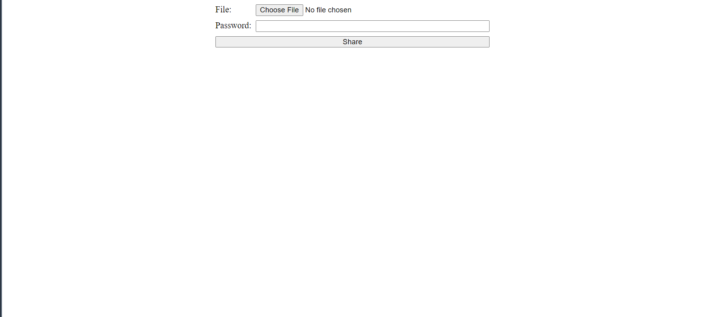

# D-linkzz
 A web application that helps users to share any files by uploading them on the server and sharing the URL provided by the server to download using the password.

## Home Page

## Tech Stack

**Client:** For the client side, we used React to build our web application.

**Styling:** The designing/styling of the web application is built using CSS.

**Server:** For the server side, we used NodeJS & ExpressJS to make a REST API.

